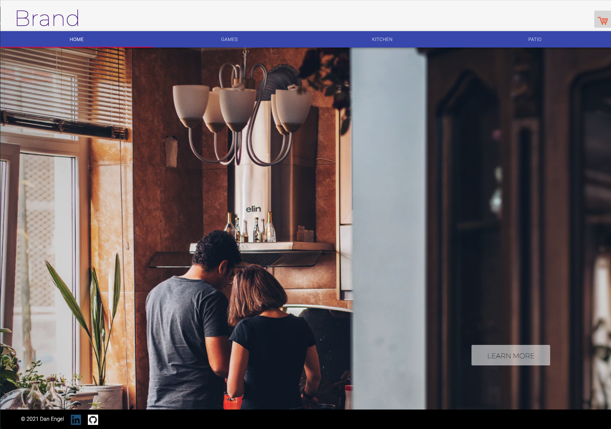

___

## About Me

🔭 I’m currently working on ...
  - learning all about AWS services.
  - refining my portfolio.
   - making connections in the industry.

📫 How to reach me:
  - engeldb@gmail.com
  - [Linkedin](https://www.linkedin.com/in/danengel-seattle/)

😄 Pronouns: he/him

___

## Work History

Prior to learning to code, I spent several years working in the commercial photography industry where I learned the value of collaboration, built a strong work ethic, and found that I'm pretty good at problem solving.

Top5 qualities I bring to my work:

- Integrity
- Generosity
- Dependable
- Adaptable
- Strong Communicator

___

## Portfolio

### *REBU 2.0* - this was the final project for Code Fellows that my team built. It is an Uber clone that is built in React Native and uses Google Maps API.

Project Highlights:
- Built in just four days! 
- Custom built server API that connects the front-end to our sign-up/login and MongoDB.
- Users can register as a driver or rider.
- Riders will get instant notifications when a driver accepts their ride, when the car has arrived for pick-up and when the the ride is completed.
- Start and end location auto-complete using Google Maps.
- Shows route on a map using Google Maps API.
- Displays distance, duration and expected cost.
- CI/CD deployment on Expo.
- Credit Card capture in profile.

[API Server Repo](https://github.com/daneng1/auth-api-1)

[Front-end Repo](https://github.com/daneng1/RebuNative)

If you have the Expo app on your phone, take a pic of the QR code and the app will load on your phone.

---
---

### *React Redux Storefront* - this is a storefront website built in React with state management built in Redux.

Project Highlights:

- Full CRUD app with dynamic cart and checkout.
- Redux state management.
- MongoDB database for products.
- Credit card capture in checkout.

[Storefront Repo](https://github.com/daneng1/storefont)

[Deployed Site](https://danengel-storefront.netlify.app/)

