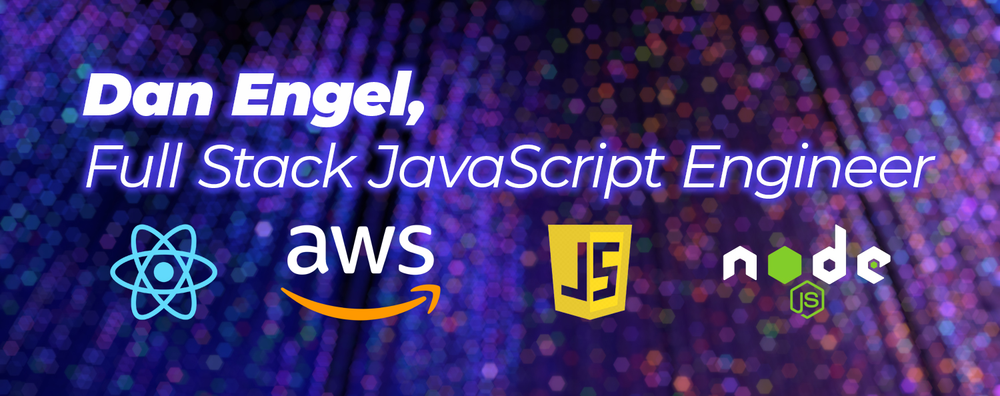

___

## About Me

🔭 I’m currently working on ...
  - learning all about AWS services.
  - refining my portfolio.
   - making connections in the industry.

📫 How to reach me:
  - engeldb@gmail.com
  - [Linkedin](https://www.linkedin.com/in/danengel-seattle/)

😄 Pronouns: he/him

___

## Work History

Prior to learning to code, I spent several years working in the commercial photography industry where I learned the value of collaboration, built a strong work ethic, and found that I'm pretty good at problem solving.

Top5 qualities I bring to my work:

- Integrity
- Generosity
- Dependable
- Adaptable
- Strong Communicator

___

## Portfolio

